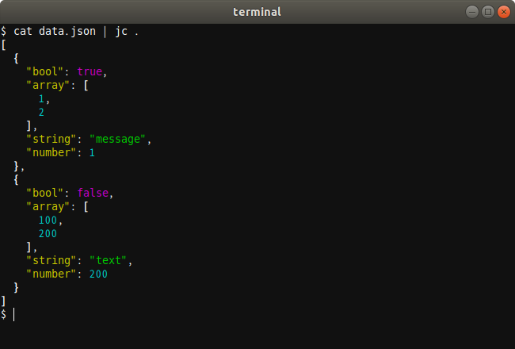
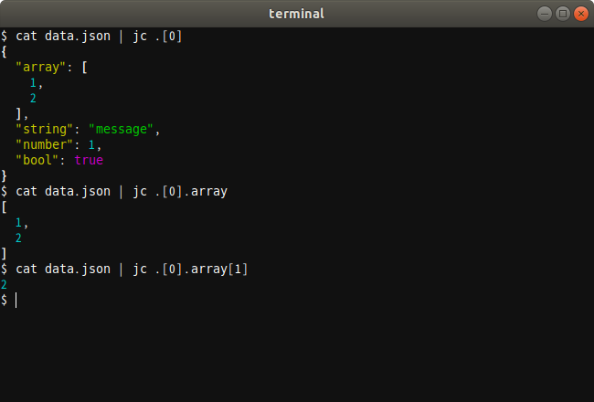

# jc

**jc** is a tool to format, color and print JSON input.
It makes JSON object easy to read.





## Usage

### Print all JSON object.

```bash
$ cat data.json | jc .
```

### Print filtered JSON object.

```bash
# Print a value at the key "foo".
$ cat data.json | jc .foo

# Print a first element of the array.
$ cat data.json | jc .[0]

# Print a value at the key "bar" in the second element of an array at the key "foo".
$ cat data.json | jc .foo[1].bar
```

### Print JSON object without coloring.

```bash
$ cat data.json | jc --color=false .
```

## Install

Prerequisite Tools

- Git
- Go (at least Go 1.11)

```bash
$ git clone https://github.com/x-color/jc.git
$ cd jc
$ go install
```

## License

Apache License 2.0
